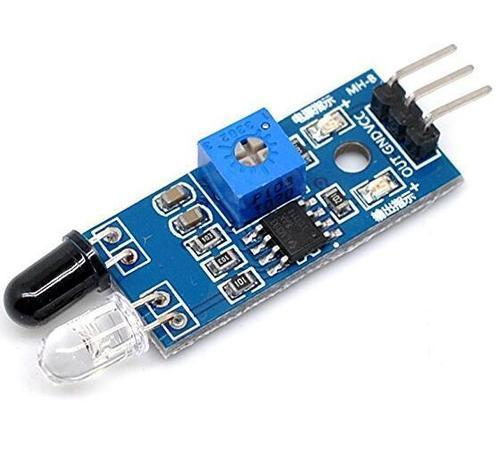
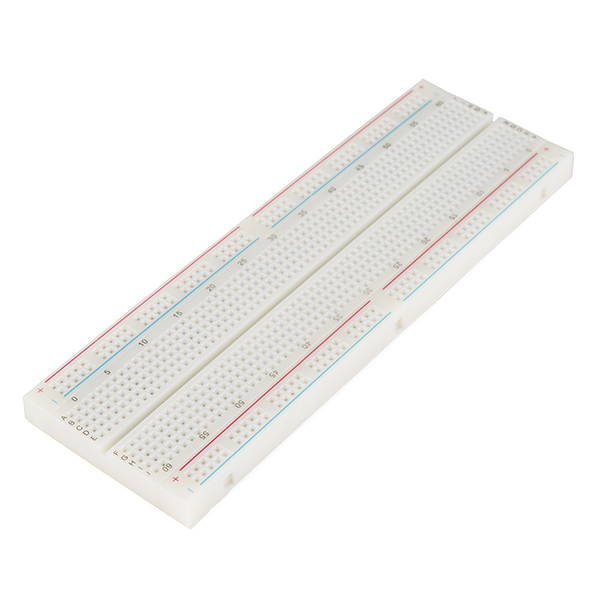

# Security-System-Repo

This is a Sequrity System Repo

this is based on the basic concept of the python language.
simple to understand.

# Requirmets:

1. Raspberry pi 3 b+

2. 4 x 4 Keypad 

3. 16 x 2 lcd display

4. IR Sensor

5. Breadbord (if you want to test)

6. Jumper wires

# Dependencies in python:

1. xlrd 

2. xlwt

3. xlutils

4. requests

5. RPi.GPIO

# Pin Configuration:

1. LCD PINS : 

d0 = 3
d1 = 5
d2 = 7
d3 = 11
d4 = 13
d5 = 15
d6 = 19
d7 = 21
rs = 23
en = 29

2. 4 x 4 KEYPAD PINS:

Row = 8, 10, 12, 16

Col = 18, 22, 24, 26

3. IR PINS:

IN = 37

Power = +5v

Ground = GND
